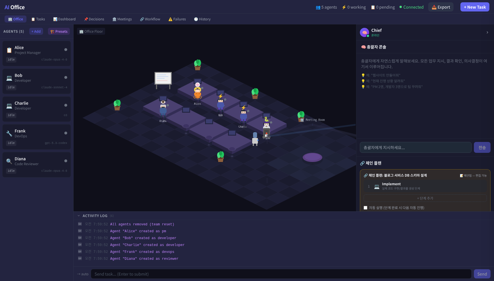

<div align="center">

# ClawHQ

### Your AI team, one office. Brainstorm, plan, build, review — together.

An open-source AI team operating system built on [OpenClaw](https://github.com/openclaw/openclaw).
Agents brainstorm ideas, debate approaches, score candidates, write specs, implement code, and review each other's work — just like a real engineering team.

[](https://www.typescriptlang.org/)
[](https://react.dev/)
[](LICENSE)



</div>

## 🎬 Demo

> Chief chat → Brainstorm meeting → Reviewer scoring → Implementation chain → Completed

https://github.com/user-attachments/assets/a636ff8b-c65c-4a23-84b3-fd596128caf7

---

## 🤔 Why ClawHQ?

**A single AI agent has blind spots. A team doesn't.**

When you ask one agent to "build a todo app," you get one perspective, one architecture, no second opinion. If there's a bad decision buried in the code, nobody catches it.

ClawHQ runs a **team** — and teams work differently:

| | Single Agent | ClawHQ Team |
|---|---|---|
| **Ideas** | One approach, no alternatives | 3 agents brainstorm, 5+ competing candidates |
| **Quality** | Self-review (marking your own homework) | Independent reviewers score with structured scorecards |
| **Decisions** | Implicit, no record | Full audit trail — who proposed what, who scored how |
| **Failures** | "It broke" | Failure timeline with event context and root cause |
| **Visibility** | Terminal logs | Real-time office view, dashboard, meeting history |

- 🖥️ **Visual, not terminal** — Watch your team work in a real-time isometric office, not scroll through logs
- 📊 **Structured decisions, not black boxes** — Scorecards, voting, and full audit trails for every choice
- 🏛️ **Real meetings, not prompt chains** — 13 meeting types with proposals, debate, and synthesis
- 🔥 **Debug failures, not guess** — Failure timeline with event replay and root cause context
- 📈 **Observe everything** — KPI metrics, time series charts, and alert system built in

---

## ✨ Features

- 🏢 **Isometric Office View** — PixiJS 2.5D office with agent sprites, desks, meeting room, and decorations
- 🧠 **Chief Chat** — Natural language control, proactive check-ins, inline actions, notifications
- 👥 **Multi-Agent Teams** — 6 roles: PM, Developer, Reviewer, Designer, DevOps, QA
- ⛓️ **Chain Plans** — Editable task pipeline (plan → implement → review) with visual chain editor
- 🏗️ **Team Presets** — Pre-configured team templates for common workflows
- 📋 **13 Meeting Types** — brainstorm, planning, review, retrospective, kickoff, architecture, design, sprint-planning, estimation, demo, postmortem, code-review, daily
- 🔬 **Tech Spec Meeting** — 4-panel discussion (CTO / Frontend Lead / Backend Lead / QA) with conflict detection and synthesis
- ⚖️ **Decision System** — Proposal comparison, reviewer scorecards, Devil's Advocate, approve/revise/reject
- 📦 **Deliverables** — 6 types (Web / Code / Report / Data / Document / API) with live preview
- ⏪ **History Replay** — Event timeline playback for full session audit
- 📊 **Monitoring Dashboard** — KPI metrics, time series charts, alert system
- 🔥 **Failure Timeline** — Debug operational issues with full event context
- 🏢 **Meeting Lineage** — Parent-child meeting relationships, candidate inheritance
- 🌐 **i18n** — Full English and Korean language support

---

## 🚀 Quickstart

```bash
git clone https://github.com/pizzalist/ClawHQ.git
cd ClawHQ/app
npm install
npm run dev
```

Requires [OpenClaw](https://github.com/openclaw/openclaw) for agent orchestration.

Open **http://localhost:3000** and try Chief Chat:
1. `Build me a todo app` → PM creates a spec
2. `yes` → Dev implements, Reviewer evaluates
3. `approve` → Decision finalized, visible in dashboard

---

## 🏗️ Architecture

```
Frontend: React + PixiJS + Zustand
Backend:  Express + WebSocket + SQLite
Runtime:  OpenClaw sessions

UI ↔ WebSocket/API ↔ Task Queue ↔ Agent Runtime ↔ Results/Events
```

**Tech Stack:** React · PixiJS · Zustand · Express · WebSocket · SQLite · TypeScript

---

## 📁 Project Structure

```text
app/
├── packages/
│   ├── web/      # React + PixiJS UI
│   ├── server/   # Express + task orchestration + DB
│   └── shared/   # Shared types
├── scripts/      # Demo, fixture, healthcheck scripts
├── docs/         # Scenarios, release notes, checklists
├── README.md
└── package.json
```

---

## 🤝 Contributing

PRs welcome! Good starting points:

- Fix bugs and add tests
- Improve scenario templates
- Add observability and quality gates
- Improve docs and onboarding

---

## 📄 License

MIT
